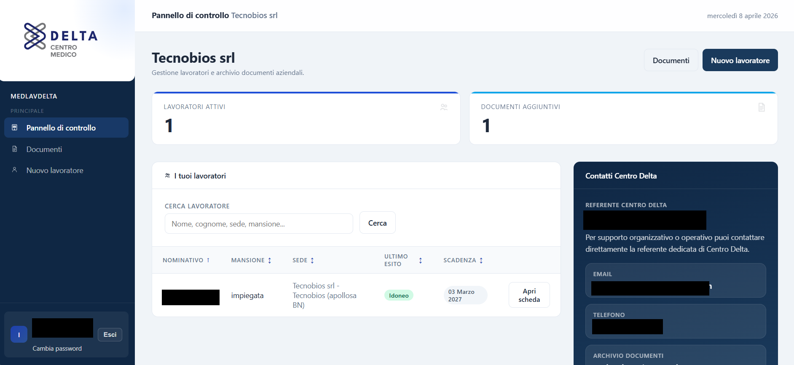

<div align="center">

# MedLavDelta_IDE

Operational management platform built to support occupational-medicine workflows inside Centro Delta.

<p>
  <a href="https://medlavdelta.it/">Live Platform</a>
</p>

<p>
  
  
  
  
</p>

</div>

## Overview

I built MedLavDelta as the management platform used by Centro Delta to simplify occupational-medicine workflows. The platform is meant to support the daily operational work around *Medicina del Lavoro*, not just present static information.

It is a role-based business application designed to coordinate administrative work, company-side activity, worker management, medical documentation, and deadline-sensitive processes.

## What the platform covers

The main workflows include:

- company onboarding and management,
- worker registration and organization,
- occupational-health records,
- medical visit outcomes and expirations,
- company and medical document management,
- dashboards and notifications for different user roles.

## Product workflow

The publishable product flow includes:

- a Centro Delta administrative dashboard for global activity overview,
- company-specific workspaces where each client can manage workers and supporting documents,
- expiry-oriented views that help track visits and medical-document deadlines,
- role-aware navigation that separates internal administration from company-side usage.

## Screenshots

<table>
  <tr>
    <td align="center" width="50%">
      
      <br />
      <sub><b>Administrative overview</b></sub>
    </td>
    <td align="center" width="50%">
      
      <br />
      <sub><b>Company workspace</b></sub>
    </td>
  </tr>
</table>

## Tech stack

- Django
- PostgreSQL
- Pillow
- ReportLab
- svglib

## Main Django apps

- `apps.accounts`
- `apps.aziende`
- `apps.commerciale`
- `apps.sanitaria`
- `apps.notifiche`

## Local setup

```bash
python -m venv .venv
source .venv/bin/activate
pip install -r requirements.txt
python manage.py migrate
python manage.py createsuperuser
python manage.py runserver
```

On Windows, activate the environment with `.venv\\Scripts\\activate`.

## Configuration

The project expects runtime values for:

- `SECRET_KEY`
- `DEBUG`
- `ALLOWED_HOSTS`
- `DB_NAME`
- `DB_USER`
- `DB_PASSWORD`
- `DB_HOST`
- `DB_PORT`
- email-related settings used by the platform

## Public release notes

- The platform mirrors a real business workflow, so the public repository focuses on product structure and usage rather than business-sensitive runtime data.
- Uploaded company and health documents are part of the normal workflow, so any production deployment should be configured with persistent media storage.
- Screenshots in this repository are intentionally redacted wherever names, emails, phone numbers, or other identifiable details appeared in production-like views.
